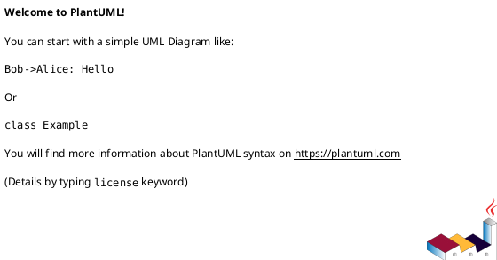
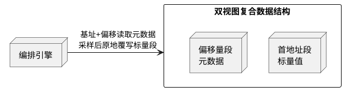

# Patent Disclosure Template / 专利交底书模板

This template defines the standard sections for each patent disclosure document. Follow this structure exactly.

**Output language:** Default is Chinese (中文). English is supported if explicitly requested.

**Diagram format:** Prefer **PlantUML** for all diagrams. Fall back to **Mermaid** if PlantUML rendering is unavailable. Both use editable text syntax (可编辑格式).

**Other elements:** Use **tables** for structured comparisons and quantitative data. Use **KaTeX** (`$...$` inline, `$$...$$` block) for formulas when they clarify the mechanism.

---

## 专利交底书：[发明名称]

## 1. 背景技术、与本发明相关的现有技术、现有技术的缺点

[行业背景：1-2段，描述本专利所处的技术领域和应用场景]

[现有技术方案一：名称与描述]
[该方案的**技术层面**缺点——从系统行为、内存布局、CPU/GPU资源、I/O模式、指令路径等底层角度描述]

[现有技术方案二：名称与描述]
[该方案的**技术层面**缺点]

[现有技术方案三（如有）：名称与描述]
[该方案的**技术层面**缺点]

[总结段：归纳现有技术的共同技术缺陷/根本性矛盾，点明本领域亟需突破的技术瓶颈]

## 2. 本发明的技术方案

### 2.1 本发明所要解决的技术问题

[一句话或一段话精确描述技术问题，必须与技术相关，不能是功能描述]

模板句式：针对现有技术中存在的[具体技术缺陷1]——导致[系统层面的后果1]——以及[具体技术缺陷2]——导致[系统层面的后果2]——进而使[系统瓶颈/限制]等**技术问题**，本发明提供一种[发明名称]。

### 2.2 本发明的完整技术方案

[这是专利最重要的部分，需详细展开]

[概述段：本发明的整体技术方案遵循"XXX—XXX—XXX"N层方法论，由以下环节有机组成]

#### （一）[第一核心机制名称]

[核心思想概述]

[具体机制描述，包含特征性步骤编号 S1-SN 或结构性描述]

[附图：优先使用 PlantUML，备选 Mermaid。方框图/流程图形式，黑白风格]



[若 PlantUML 不可用，备选：]

```mermaid
graph TB
    %% Mermaid diagram — fallback format
```

[对附图的文字描述——使他人不看图也能理解]

[表格（当有结构化对比或定量数据时使用）：]

| 对比维度 | 现有技术A | 现有技术B | 本发明 |
| --- | --- | --- | --- |
| [维度1] | [值] | [值] | [值] |
| [维度2] | [值] | [值] | [值] |

[对表格的文字描述]

[公式（当数学表达能更精确地描述机制时使用）：]

$$
[公式]
$$

[对公式的文字描述——解释每个符号的含义]

#### （二）[第二核心机制名称]

[同上结构]

#### （N）[整体方法论架构图]

[综合所有机制的架构总图]

#### （N+1）[跨场景复用性验证]

[场景A：描述一个完全不同的应用领域]
[场景B：描述另一个完全不同的应用领域]
[复用性结论：指出在不同场景下哪些逻辑路径保持零改动，证明平台级复用性]

### 2.3 本发明技术方案的有益效果

[与现有技术相比，本发明具有以下有益效果。每条必须：① 对应2.1节的某个技术问题；② 使用系统行为语言（内存、缓存、I/O、指令、锁等）；③ 包含定量推演/投影数据。]

1. 本发明通过[机制A]，[技术效果的底层描述]。在[典型规模]场景下，[定量对比：现有技术 ~X次[操作] vs 本发明 ~Y次[操作]，[操作类型]减少约Z%]。相应地，[底层系统指标]呈[变化趋势]，[更高层系统指标]由此改善。

2. ...

## 3. 针对2中的技术方案，是否还有别的替代方案同样能完成发明目的

[4-8条替代方案，每条可以是部分替代或完整替代]

1. [机制名称]实现替代：[方案A]可替换为[替代A1]、[替代A2]、或[替代A3]方式；
2. ...

## 4. 本发明的技术关键点和欲保护点是什么？

[一段总述，然后列出关键技术点]

一种[发明名称]，其技术关键点和欲保护点包括：

- [保护点1：描述具体的机制/结构/步骤组合，用"其特征在于"语言]
- [保护点2]
- ...

---

## Diagram Format Reference

### PlantUML (Preferred)

Use PlantUML by default for its superior Chinese text rendering and component diagrams.

**Common diagram types:**

- `@startuml` ... `@enduml` — General diagram
- Component/Node diagrams for architecture
- Flowchart with `:step;` and `if () then (yes) else (no) endif`
- Sequence diagrams with `->` arrows

**Example:**



### Mermaid (Fallback)

Use Mermaid when PlantUML is not supported in the rendering environment.

---

## Tables Reference

Use Markdown tables for structured data. Common use cases in patent disclosures:

**Comparison table (existing tech vs. invention):**

```markdown
| 对比维度 | 现有技术A | 现有技术B | 本发明 |
| --- | --- | --- | --- |
| 内存布局 | 元数据与取值分离 | 配置文件外部存储 | 单一连续内存块同体表征 |
| 采样开销 | 跨对象拷贝 | 反序列化+解析 | 原地覆写（无拷贝） |
```

**Quantitative data table:**

```markdown
| 指标 | 现有技术 | 本发明 | 降幅 |
| --- | --- | --- | --- |
| 内存总线事务（次） | 2000 | 1000 | 50% |
| 校验执行次数 | 100/任务 | 1/任务 | 99% |
```

**Scenario matrix (cross-scenario validation):**

```markdown
| 场景 | 数据类型 | 参数类型 | 逻辑改动 |
| --- | --- | --- | --- |
| 工业视觉 | 图像张量 | TunableInt(3,15,step=2) | 零 |
| 智能家电 | 时序序列 | TunableFloat(0.5,5.0,log=True) | 零 |
```

---

## Formulas Reference

Use KaTeX math for precise technical notation. Common use cases:

**Complexity bounds (inline):**

```markdown
最坏情况时间复杂度从 $O(n^2)$ 降至 $O(n \\log n)$
```

**Constraint equations (block):**

```markdown
$$
\\text{cache-hit-ratio} = \\frac{\\text{accesses} - \\text{misses}}{\\text{accesses}}
$$
```

**Algorithmic notation (block):**

```markdown
$$
S = \\{k \\mid k \\in \\text{search\\_space} \\land k \\notin \\text{sig\\_params}\\}
$$
```

Always follow each formula with a plain-text explanation of every symbol.

