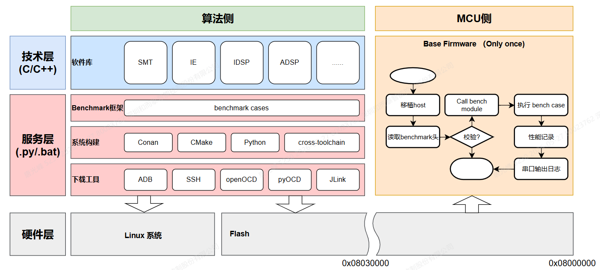
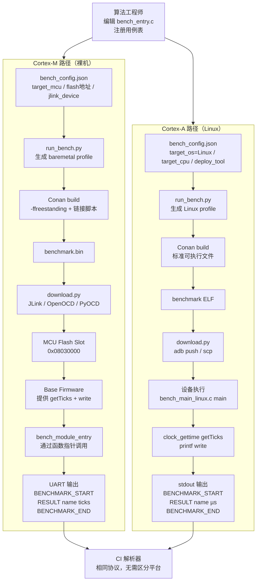

# Benchmark Framework

基于 Conan + CMake 的**自动化算法上板 Benchmark 框架**，同时支持 **Cortex-M（裸机）** 和 **Cortex-A（Linux）** 两类目标平台。

> **设计目标**：库开发者只需编辑两个文件（算法用例 + 板卡配置），一条命令完成编译→部署→采集，可直接对接 CI/CD 流水线。

---

## 目录结构

```
benchmark/
├── bench_entry.c              ← 【算法工程师编辑】用例注册入口（MCU/Linux 共用）
├── algo_module.ld.in          ← Linker Script 模板（仅裸机，自动填充地址）
├── CMakeLists.txt             ← 双目标编译脚本（baremetal / Linux 自动分支）
├── conanfile.py               ← Conan 包配方（不需要修改）
├── build.bat                  ← 一键入口脚本
├── core/
│   ├── het_bench_core.h       ← Benchmark ABI（HostInterface、Case、Manifest）
│   └── het_bench_core.c       ← 运行时（计时、输出、用例调度）—— MCU/Linux 共用
├── platform/
│   ├── bench_config.json          ← 【每块板卡配置一次】Cortex-M 硬件参数
│   └── bench_config_linux.json    ← 【参考模板】Cortex-A Linux 硬件参数示例
├── port/
│   └── linux/
│       └── bench_main_linux.c ← 【A 核唯一新增 .c】main() + clock_gettime + printf
├── profiles/                  ← 自动生成的 Conan profile（勿手动编辑，每次构建覆盖）
└── script/
    ├── run_bench.py           ← 核心自动化脚本（生成 profile、构建、部署）
    └── download.py            ← 部署后端（JLink / OpenOCD / PyOCD / ADB / SSH）
```

---

## 平台对比

| 项目 | Cortex-M（裸机） | Cortex-A（Linux） |
|------|-----------------|-------------------|
| 入口 | Base Firmware 通过函数指针调用 | `main()` 直接调用 |
| 计时 | SYSTICK（由 Base Firmware 提供） | `clock_gettime(CLOCK_MONOTONIC)` → µs |
| 输出 | UART 回调 → 串口捕获 | `printf()` → stdout（ADB/SSH 捕获） |
| 输出协议 | `BENCHMARK_START / RESULT / BENCHMARK_END` | **完全相同** |
| 部署 | JLink / OpenOCD / PyOCD 烧录 | `adb push` / `scp` 传输后执行 |
| 新增端口文件 | 无（Base Firmware 已提供） | `port/linux/bench_main_linux.c` |
| `bench_entry.c` | 共用，无需修改 | 共用，无需修改 |
| `het_bench_core.c` | 共用，无需修改 | 共用，无需修改 |

---

## 快速上手

### 前提条件

```bash
pip install conan          # Conan ≥ 2.0
conan profile detect --force

# 激活项目虚拟环境（如有）
source /path/to/.venv/bin/activate
```

| 工具 | 说明 |
|------|------|
| Python ≥ 3.10 | 运行脚本 |
| Conan ≥ 2.0 | 构建系统 |
| CMake ≥ 3.28 | 由 Conan 自动安装 |
| arm-toolchain | 由 Conan `arm-toolchain` 包自动安装 |
| JLink / OpenOCD / PyOCD | Cortex-M 烧录，见[烧录工具安装](#烧录工具安装) |
| adb / ssh | Cortex-A Linux 部署 |

---

### Step 1：配置板卡参数（每块新板配置一次）

根据目标平台选择对应的配置：

#### Cortex-M / 裸机

编辑 `bench_config.json`：

```json
{
  "target_mcu":               "cortex-m0",
  "float_abi":                "soft",
  "fpu":                      "none",
  "algo_flash_origin":        "0x08030000",
  "algo_ram_origin":          "0x20002000",
  "compiler_version":         "14",
  "toolchain_package_version":"11.3.rel1",

  "flash_tool":               "jlink",
  "jlink_device":             "BAT32G157GK64FB"
}
```

| 字段 | 说明 | 示例 |
|------|------|------|
| `target_mcu` | Cortex-M 核心型号 | `cortex-m0` / `cortex-m4` / `cortex-m7` |
| `float_abi` | 浮点 ABI | `soft`（M0/M3） / `hard`（M4F/M7） |
| `fpu` | FPU 型号 | `none` / `fpv4-sp-d16` / `fpv5-d16` |
| `algo_flash_origin` | 算法 Slot Flash 起始地址 | `0x08030000` |
| `algo_ram_origin` | 算法 Slot RAM 起始地址 | `0x20002000` |
| `flash_tool` | 烧录工具 | `jlink` / `openocd` / `pyocd` |
| `jlink_device` | J-Link 器件名 | `BAT32G157GK64FB` / `STM32F407VG` |

#### Cortex-A / Linux

复制示例文件后编辑：

```bash
cp bench_config_linux.json bench_config.json
```

```json
{
  "target_os":                 "Linux",
  "target_cpu":                "cortex-a7",
  "float_abi":                 "hard",
  "fpu":                       "neon-vfpv4",
  "extra_cflags":              ["-mthumb"],
  "compiler_version":          "11",
  "toolchain_package_version": "11.3.rel1",

  "deploy_tool":               "adb",
  "remote_path":               "/data/local/tmp/benchmark",

  "ssh_host":                  "root@192.168.1.100"
}
```

| 字段 | 说明 | 示例 |
|------|------|------|
| `target_os` | 目标操作系统 | `"Linux"`（A 核） / 省略（默认 baremetal） |
| `target_cpu` | Cortex-A 核心型号 | `cortex-a7` / `cortex-a53` / `cortex-a55` |
| `deploy_tool` | 部署方式 | `adb`（USB）/ `ssh`（网络） |
| `remote_path` | 目标设备上的路径 | `/data/local/tmp/benchmark` |
| `ssh_host` | SSH 目标地址（ssh 模式） | `root@192.168.1.100` |

> **多板管理**：不同板卡创建不同 `*.json` 文件（如 `board_m0.json`、`board_a7.json`），用 `--config` 参数切换。

---

### Step 2：编写算法测试用例（MCU / Linux 完全一致）

编辑 `bench_entry.c`，**只修改 USER ZONE 内的内容**：

```c
/* ============================================================
 * USER ZONE — 算法工程师只修改此区域
 * ============================================================ */

#define MODULE_NAME "MyAlgo-v2.1"

#include "my_algo/filter.h"
#include "my_algo/fft.h"

static float g_signal[256];

static void bench_prepare_input(void)
{
    for (uint32_t i = 0; i < 256; ++i)
        g_signal[i] = (float)i * 0.01f;
}

static int bench_fir_filter(const void * const ctx)
{
    (void)ctx;
    my_fir_filter(g_signal, 256);
    return 1;   // 返回 1 = 通过，0 = 失败
}

static int bench_fft_256(const void * const ctx)
{
    (void)ctx;
    my_fft(g_signal, 256);
    return 1;
}

static const Case bench_table[] = {
    BENCHMARK_CASE_IMPLEMENTATION("fir_n256", 0, bench_fir_filter, 100U),
    BENCHMARK_CASE_IMPLEMENTATION("fft_n256", 0, bench_fft_256,    100U),
};

BENCHMARK_IMPLEMENTATION(MODULE_NAME, bench_table);
```

> **注意**：`bench_prepare_input()` 在 `bench_module_entry()` 入口处调用一次，适合初始化全局测试数据。

---

### Step 3：本机编译验证（无需硬件）

```bash
cd benchmark/
./build.bat --no-flash
```

**Cortex-M 预期输出：**

```
[INFO] Profile generated: profiles/cortex-m0.profile
...
[BIN] Generating benchmark.bin
[SIZE] Binary size summary
   text    data     bss     dec
   4152      16    1540    5708
Output: build/Release/benchmark.bin
[INFO] --no-flash specified, skipping download step.
```

**Cortex-A Linux 预期输出（bench_config.json 已设 target_os=Linux）：**

```
[INFO] Profile generated: profiles/cortex-a7.profile
...
[SIZE] Binary size summary
   text    data     bss     dec
  12480     512    2048   15040
Output: build/Release/benchmark
[INFO] --no-flash specified, skipping download step.
```

**Cortex-M 编译产物：**

| 文件 | 用途 |
|------|------|
| `build/Release/benchmark.bin` | 烧录到 Flash Slot |
| `build/Release/benchmark.hex` | Intel HEX 格式备用 |
| `build/Release/benchmark.map` | 链接映射（调试 Flash/RAM 占用） |
| `build/Release/benchmark.dis` | 反汇编（性能分析用） |

**Cortex-A Linux 编译产物：**

| 文件 | 用途 |
|------|------|
| `build/Release/benchmark` | 交叉编译的 ELF，直接部署到设备执行 |

---

### Step 4a：Cortex-M 烧录上板

```bash
./build.bat
```

`run_bench.py` 依次执行：构建 → `download.py` 烧录 → 等待 UART 输出。

手动烧录（跳过编译）：

```bash
python3 script/download.py \
    --binary build/Release/benchmark.bin \
    --mode   jlink \
    --addr   0x08030000 \
    --device BAT32G157GK64FB
```

### Step 4b：Cortex-A Linux 部署运行

```bash
./build.bat
```

`run_bench.py` 依次执行：构建 → `download.py` 推送并运行 → 输出打印到终端。

手动部署（跳过编译）：

```bash
# ADB
python3 script/download.py \
    --binary build/Release/benchmark \
    --mode   adb \
    --remote /data/local/tmp/benchmark \
    --run

# SSH
python3 script/download.py \
    --binary build/Release/benchmark \
    --mode   ssh \
    --host   root@192.168.1.100 \
    --remote /tmp/benchmark \
    --run
```

---

### Step 5：采集输出结果

两种平台的输出协议**完全一致**，均为机器可读格式，CI 解析器无需区分平台。

**Cortex-M**：从串口读取

```bash
minicom -D /dev/ttyUSB0 -b 115200
```

**Cortex-A Linux**：从 ADB/SSH 的 stdout 直接捕获（`--run` 时自动打印）

**输出协议：**

```
BENCHMARK_START
MODULE|MyAlgo-v2.1|cases=2
RESULT|fir_n256|18432
RESULT|fft_n256|47120
BENCHMARK_END
```

| 行格式 | 含义 |
|--------|------|
| `BENCHMARK_START` | Benchmark 开始标记 |
| `MODULE\|<名称>\|cases=<N>` | 模块信息 |
| `RESULT\|<用例名>\|<Tick 数>` | 单用例结果（repeat 次重复的总计时） |
| `CASE_ERROR\|<用例名> [N/M]` | 用例返回 0（失败），N 为失败时的迭代号 |
| `BENCHMARK_END` | Benchmark 结束标记 |

> Cortex-M 的 Tick 单位由 Base Firmware 的 `getTicks()` 决定；Cortex-A Linux 的 Tick 单位为 **µs**（`clock_gettime` 精度）。

---

## 多目标板批量 Benchmark

```bash
# 串行执行（多块板卡）
for cfg in board_m0.json board_m4.json board_a7.json; do
    python3 script/run_bench.py --config "platform/$cfg"
done

# 并行编译（仅构建，不需要硬件）
python3 script/run_bench.py --config platform/board_m0.json --no-flash &
python3 script/run_bench.py --config platform/board_m4.json --no-flash &
python3 script/run_bench.py --config platform/board_a7.json --no-flash &
wait
```

---

## CI/CD 集成

### GitHub Actions 示例

```yaml
name: Benchmark

on:
  push:
    branches: [main, dev]
  pull_request:
    branches: [main]

jobs:
  # ── 阶段 1：交叉编译（任何 Runner，无需硬件） ──────────────────
  build:
    name: Build (${{ matrix.config }})
    runs-on: ubuntu-latest
    strategy:
      matrix:
        config: [board_m0.json, board_m4.json, board_a7.json]

    steps:
      - uses: actions/checkout@v4

      - uses: actions/setup-python@v5
        with:
          python-version: "3.12"

      - run: pip install conan && conan profile detect --force

      - name: Cross-compile benchmark
        working-directory: benchmark
        run: python3 script/run_bench.py --config ${{ matrix.config }} --no-flash

      - uses: actions/upload-artifact@v4
        with:
          name: benchmark-${{ matrix.config }}
          # Cortex-M 上传 .bin；Cortex-A 上传 ELF
          path: |
            benchmark/build/Release/benchmark.bin
            benchmark/build/Release/benchmark

  # ── 阶段 2：上板测试（自托管 Runner，连接物理板卡） ─────────────
  test-mcu:
    name: On-board MCU test
    runs-on: [self-hosted, mcuboard]
    needs: build
    if: github.ref == 'refs/heads/main'
    steps:
      - uses: actions/checkout@v4
      - uses: actions/download-artifact@v4
        with:
          name: benchmark-board_m0.json
          path: benchmark/build/Release/
      - name: Flash and test
        working-directory: benchmark
        run: python3 script/run_bench.py --config platform/board_m0.json

  test-linux:
    name: On-board Linux test (ADB)
    runs-on: [self-hosted, linuxboard]
    needs: build
    if: github.ref == 'refs/heads/main'
    steps:
      - uses: actions/checkout@v4
      - uses: actions/download-artifact@v4
        with:
          name: benchmark-board_a7.json
          path: benchmark/build/Release/
      - name: Deploy and test
        working-directory: benchmark
        run: python3 script/run_bench.py --config platform/board_a7.json
```

### 本地 CI 脚本（GitLab / Jenkins 等）

```bash
#!/usr/bin/env bash
set -euo pipefail

source .venv/bin/activate
cd benchmark

# 阶段 1：编译（任何机器）
python3 script/run_bench.py --config platform/board_m0.json  --no-flash
python3 script/run_bench.py --config platform/board_a7.json  --no-flash

# 阶段 2：上板（按接入的硬件类型决定）
if [[ "${CI_HAS_MCU:-0}" == "1" ]]; then
    python3 script/run_bench.py --config platform/board_m0.json
fi
if [[ "${CI_HAS_LINUX_BOARD:-0}" == "1" ]]; then
    python3 script/run_bench.py --config platform/board_a7.json
fi
```

---

## 烧录工具安装

### J-Link（Cortex-M 推荐）

```bash
# Ubuntu / Debian
wget https://www.segger.com/downloads/jlink/JLink_Linux_x86_64.deb
sudo dpkg -i JLink_Linux_x86_64.deb
JLinkExe -version
```

### OpenOCD

```bash
sudo apt install openocd   # Ubuntu
brew install open-ocd       # macOS
```

**ST-Link 使用注意事项**（以 STM32F205 + ST-Link/V2.1 为例）：

1. **`transport select` 与 interface cfg 冲突**：`interface/stlink.cfg` 内部通过 HLA（High-Level Adapter）协议自动选定 `hla_swd`/`hla_jtag`，若命令行再显式指定 `swd`/`jtag`（不带 `hla_` 前缀）会报错 `Can't change session's transport after the initial selection was made`。`download.py` 已按 `--interface` 文件名自动加上 `hla_` 前缀，无需手动处理；若看到 `Warn: Transport "hla_swd" was already selected`，这只是提示，不影响烧录。
2. **`LIBUSB_ERROR_ACCESS`**：Linux 下普通用户默认没有权限直接访问 USB 设备节点，需添加 udev 规则（VID:PID 可用 `lsusb` 查看，ST-Link/V2.1 通常是 `0483:374b`）：
   ```bash
   sudo tee /etc/udev/rules.d/49-stlink.rules > /dev/null <<'EOF'
   SUBSYSTEM=="usb", ATTRS{idVendor}=="0483", ATTRS{idProduct}=="374b", MODE="0666", GROUP="plugdev"
   EOF
   sudo udevadm control --reload-rules && sudo udevadm trigger
   ```
   规则生效后需**拔插一次 ST-Link**（udev 只在设备重新枚举时应用规则）。
3. **烧录成功的标志**：`** Programming Finished **` → `** Verify Started **` → `** Verified OK **` → `** Resetting Target **`，全部出现即代表烧录并回读校验通过。
4. **openocd 不会捕获串口输出**：与 `adb`/`ssh` 模式不同，`openocd` 只负责烧录+复位，看不到 benchmark 的 `BENCHMARK_START/RESULT/BENCHMARK_END` 输出，需要另开串口终端（`screen /dev/ttyUSB0 <serial_baud>`）读取 UART。

### PyOCD

```bash
pip install pyocd
```

### ADB（Cortex-A Android/Linux 板）

```bash
sudo apt install adb       # Ubuntu
adb devices                # 验证设备连接
```

---

## 支持的目标平台

### Cortex-M（`target_os` 省略或 `"baremetal"`）

| `target_mcu` | Conan arch |
|--------------|------------|
| cortex-m0 / m0plus / m1 | armv6 |
| cortex-m3 / m4 / m4f / m7 / m7f / m7d | armv7 |
| cortex-m23 / m33 / m33f / m55 / m85 | armv8_32 |

### Cortex-A（`target_os: "Linux"`）

| `target_cpu` | Conan arch |
|--------------|------------|
| cortex-a5 / a7 / a8 / a9 / a15 / a17 | armv7 |
| cortex-a35 / a53 / a55 / a72 / a73 / a76 / a78 | armv8 |

> 如需添加新目标，在 `script/run_bench.py` 的 `CONAN_ARCH_MAP` 字典末尾追加一行映射即可。

---

## 框架架构





**HostInterface 抽象（`het_bench_core.h`）：**

```c
typedef struct {
    pFunGetTicks  getTicks;   // Cortex-M: SYSTICK  |  Linux: clock_gettime µs
    pFunLog       write;      // Cortex-M: UART 回调 |  Linux: fwrite(stdout)
} HostInterface;
```

`bench_entry.c` / `het_bench_core.c` 只依赖 `HostInterface`，对平台完全透明。

---

## 常见问题

**Q: 编译报 `arm-toolchain/X.Y.relZ not found`**  
A: 检查 `bench_config.json` 的 `toolchain_package_version`，确保与本地 Conan 缓存版本一致。可用 `ls ~/.conan2/p/ | grep arm-t` 查看。

**Q: Cortex-M 烧录后无 UART 输出**  
A: 确认：① binary 烧到了正确的 Flash 地址；② Base Firmware 的 `bench_host` 指向了对应 Slot；③ 串口波特率正确。

**Q: ADB 部署后设备无输出**  
A: 确认 `adb devices` 可以看到设备，且 `remote_path` 所在目录有执行权限（`adb shell chmod +x /data/local/tmp/benchmark`）。

**Q: Linux 和 MCU 的 RESULT tick 数量级不同**  
A: 正常现象——MCU 的 Tick 是 Base Firmware 定义的计数单位（如 CPU cycle）；Linux 的 Tick 是 µs。两者不能直接比较绝对值，但可以比较同平台不同版本的相对变化。

**Q: `CASE_ERROR` 出现在输出中**  
A: 用例 wrapper 函数返回了 `0`。检查 `bench_entry.c` 中对应函数的返回值（应返回 `1` 表示通过）。

**Q: Cortex-M Flash / RAM 不够**  
A: 修改 `algo_module.ld.in` 中的 `LENGTH`（默认 Flash 64K，RAM 32K），确保地址范围不与 Base Firmware 重叠。
